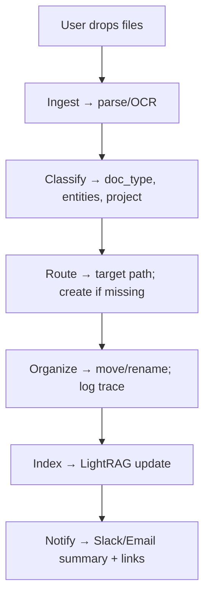

# TEKITA — Smart Filing (Agentic Knowledge Ops)
```pgsql
tentacles/tekita/
└── smart-filing/
    ├── README.md
    ├── docs/
    │   ├── vision.md
    │   ├── personas.md
    │   ├── monetization.md
    │   └── ontology.md
    ├── kita/
    │   ├── agent.yaml
    │   ├── prompts/
    │   │   ├── routing.system.md
    │   │   └── notify.user.md
    │   └── skills/
    │       ├── ingest.py
    │       ├── classify.py
    │       ├── route.py
    │       └── notify.py
    ├── lightrag/
    │   ├── quickstart.md
    │   └── indexer.py
    ├── pipelines/
    │   ├── file_intake.py
    │   ├── company_graph_build.py
    │   └── organizer.py
    ├── config/
    │   ├── folders.schema.yaml
    │   ├── contractors.schema.yaml
    │   └── env.sample
    └── tasks/
        ├── 2025-09-02_init.md
        └── 2025-09-02_lightrag_setup.md
```

**Domain:** https://tekita.ai  
**Focus:** Monetize automation while powering BrainSTEM’s data digestion

TEKITA is our automation arm. **Smart Filing** is the first product: an agentic filing system that
- accepts **drag-and-drop** folders/files,
- **auto-organizes** them by context,
- **creates** new folders when a home doesn’t exist,
- and **notifies** the user where everything lives.

Our public face is **KITA** — the filing agent — backed by a **Graph-RAG** brain so it “knows the company” and answers questions on demand.

We’re starting with **construction & trades (contractors, plumbing, electrical, GC)**: lower risk, faster feedback cycles, clear ROI; then up-market to larger contractors, legal, and (later) medical.

---

## Why Smart Filing (now)
1. **Revenue first:** clear pains (lost docs, inconsistent naming, chaos across Drive/Dropbox/Email).  
2. **Reusable pipeline:** same organism feeds **BrainSTEM** (tastebuds ↔ tentacles).  
3. **Agentic memory:** company knowledge becomes a living graph KITA can route & answer from.

---

## Architecture (v0 → v1)

### User flow (MVP)
1) **Drop** files/folders → `/inbox`  
2) **Ingest** → parse text/metadata; detect doc type; extract entities  
3) **Classify & Route** → choose target path; create folders if needed  
4) **Organize** → move/rename per `folders.schema.yaml`  
5) **Index** → update LightRAG graph + embeddings  
6) **Notify** → “Filed 17 docs → `/Projects/Acme/2024/Invoices`”

### Components
- **Ingest**: OCR (if needed), text split, metadata (dates, vendor, project).  
- **Classifier**: rule+LLM hybrid; maps to domain ontology (see `config/contractors.schema.yaml`).  
- **Router**: idempotent mover; creates missing paths; logs decisions.  
- **Indexer (LightRAG)**: builds/updates knowledge graph + vector store for KITA Q&A.  
- **Notifier**: Slack/Email summary with links and “explain my filing” trace.  
- **KITA Agent**: system prompt + tool skills (ingest/classify/route/notify/query).

> **LightRAG** blends **knowledge graphs** with **embedding retrieval** and supports local/global/hybrid query modes while staying cost-efficient; it can **append** to an existing graph without full rebuild. :contentReference[oaicite:0]{index=0}

---

## Domain ontology (contractors — starter)
See `config/contractors.schema.yaml` for the evolving shape. High-level buckets:

- `Admin/` → Insurance, Licensing, W-9, COI, Safety, HR  
- `Projects/{Client}/{Job}/`  
  - `Bids/` (RFP, Estimates, Takeoffs)  
  - `Contracts/` (MSA, SOW, Change Orders)  
  - `Permits/Inspections/`  
  - `Plans/Drawings/`  
  - `Daily Logs/Photos/`  
  - `Invoices/Receipts/`  
  - `Subcontractors/` (agreements, compliance)  
- `Vendors/{Name}/` → Quotes, POs, Invoices  
- `Finance/` → AR, AP, Payroll, Taxes

Filing rules live in `config/folders.schema.yaml` (pattern → target path; create_if_missing; rename_template).

---

## KITA (the agent)
- **Role:** Filing + Knowledge concierge.  
- **Voice:** Clear, warm, capable; “I filed these here, here’s why, and here’s your next best action.”  
- **Powers:**  
  - `ingest` (extract text/metadata)  
  - `classify` (map to ontology)  
  - `route` (create/move/rename)  
  - `index` (update LightRAG)  
  - `notify` (Slack/Email)  
  - `answer` (graph-aware Q&A: “show COIs expiring in 30 days”, “where’s the signed SOW for Willowridge?”)

---

## LightRAG quickstart (local)

> Full snippet in `lightrag/quickstart.md`. Minimal sketch:

```python
# lightrag/indexer.py
import os
from lightrag import LightRAG, QueryParam  # per package readme
# expects OPENAI_API_KEY or equivalent configured

DATA_DIR = "data/company_graph"
os.makedirs(DATA_DIR, exist_ok=True)

rag = LightRAG(DATA_DIR)                    # creates/loads the graph
def upsert_texts(text_chunks: list[str]):
    rag.insert(text_chunks)                 # appends without full rebuild
def ask(q: str, mode="hybrid"):
    return rag.query(q, param=QueryParam(mode=mode))
```

Modes: naive (vector only), local (neighbors), global (overview), hybrid (both). 

---

## File intake pipeline (MVP)



---

## Monetization (v0 → v2)
- **v0 Pilot (contractors)**
  - Setup fee $1.5k → map Drive + install TEKITA + baseline filing + week of tuning
  - Monthly $299–$799 based on volume (document count & seats)
- **Add-ons**
  - Vendor & COI tracking, permit/inspection deadline alerts
  - AP/AR extraction (invoice → ledger), QuickBooks/Xero push
  - “Find it for me” concierge (human-in-the-loop SLA)

**Positioning:** “Your documents file themselves. Your company answers back.”

---

### Ops & safety
- Idempotent moves with trace (JSON log per decision)
- Dry-run mode before first apply
- PII guardrails (mask in logs; secure storage)
- Rollback (shadow copy for N days)

---

## Getting started

1. Clone repo; copy env:
```bash
cp tentacles/tekita/smart-filing/config/env.sample .env
```
2. Fill .env: storage creds (Drive/Dropbox/S3), OpenAI key (or local), Slack webhook.
3. Run local indexer on a sample data/ set:
```bash
python tentacles/tekita/smart-filing/lightrag/indexer.py
```
4. Drop 10–20 contractor docs into /inbox/ and run:
```bash
python tentacles/tekita/smart-filing/pipelines/file_intake.py --apply --notify
```
5. Ask KITA:
```python
from lightrag.indexer import ask
print(ask("Where is the signed SOW for Acme Willowridge?", mode="hybrid"))
```

---

## Roadmap

- [ ] v0: Local folder moves + notifications + LightRAG index
- [ ] v0.1: “Explain my filing” trace per file
- [ ] v0.2: Slack slash-commands (/kita file here, /kita find <thing>)
- [ ] v0.3: Vendor/COI expiry watchlist
- [ ] v1.0: Multi-tenant dashboard + billing + audit trails
- [ ] v1.1: Legal vertical beta (narrow scope)
- [ ] v2.0: Medical pilot (PHI-safe pathways, de-identification)

---

## Mandala integration

- **tastebuds/** (digestion): entity/relationship extraction patterns and logs feed back as glyphs.
- **throat/** (expression): KITA’s answers and “filing explanations” are compressed into Memory sutras.
- **Luma overlay:** revenue + robustness signals bias future feature picks.


---

## Two small companion files (optional starters)

**`config/env.sample`**

- OPENAI_API_KEY=
- STORAGE_PROVIDER=local # local|gdrive|dropbox|s3
- STORAGE_ROOT=./data
- SLACK_WEBHOOK_URL=


**`config/folders.schema.yaml` (stub)**
```yaml
version: 0.1
rules:
  - match:
      doc_type: invoice
      project: "*"
    target: "Projects/{project}/Invoices/{yyyy}/{vendor}/"
    create_if_missing: true
    rename: "{project}_{vendor}_{yyyy}-{mm}-{dd}_invoice.pdf"

  - match:
      doc_type: contract
    target: "Projects/{project}/Contracts/"
    create_if_missing: true
    rename: "{project}_contract_{counter}.pdf"
```

---


## First tasks (drop into tasks/)

`2025-09-02_init.md`

- [ ] Create tentacles/tekita/smart-filing/ scaffold
- [ ] Add README.md (this doc)
- [ ] Commit config/env.sample, folders.schema.yaml stub
- [ ] Add kita/agent.yaml with role + tools list
- [ ] Seed docs/personas.md with KITA voice & boundaries

`2025-09-02_lightrag_setup.md`

- [ ] Install LightRAG package
- [ ] Build minimal index over /samples/contractors/
- [ ] Test query in naive, local, global, hybrid modes
- [ ] Log token usage + answer quality (keep screenshots)
